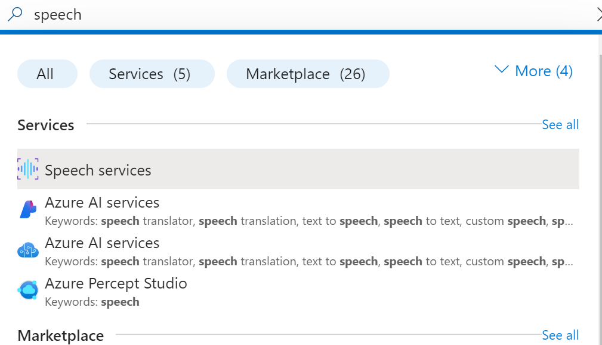
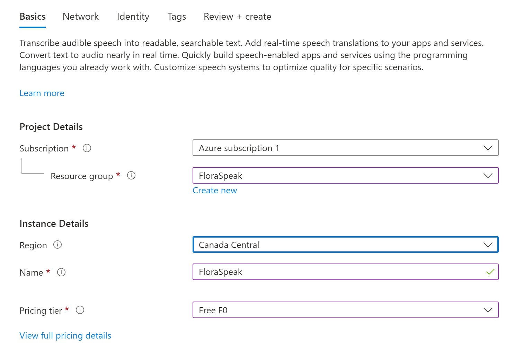
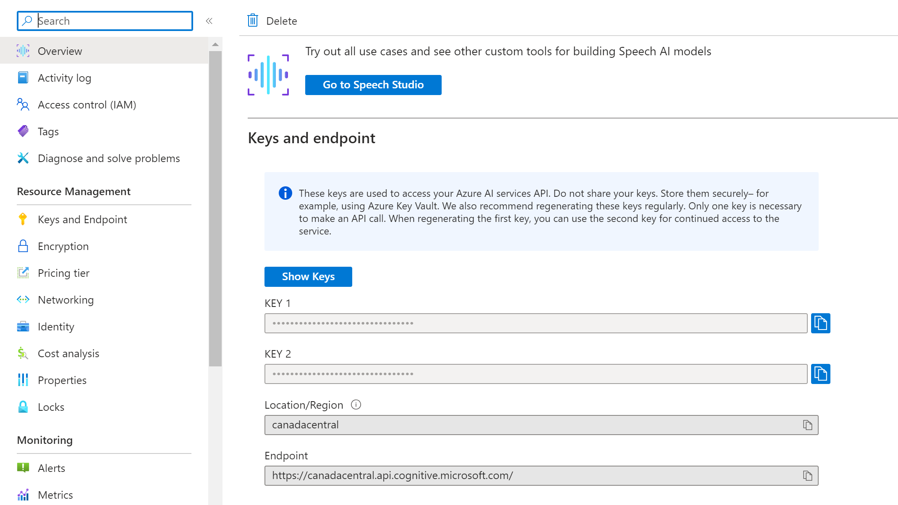
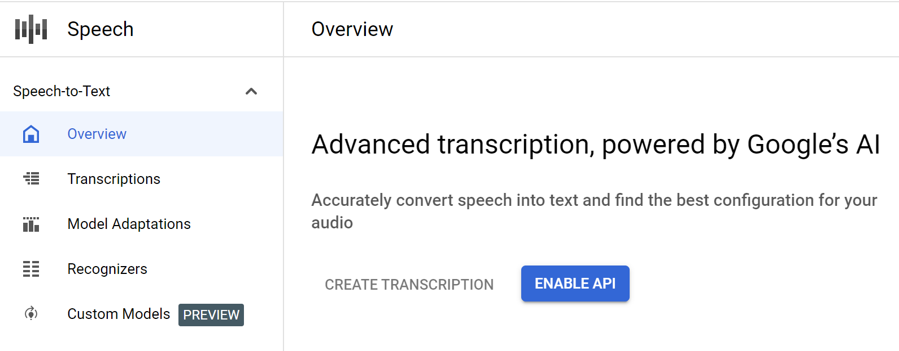
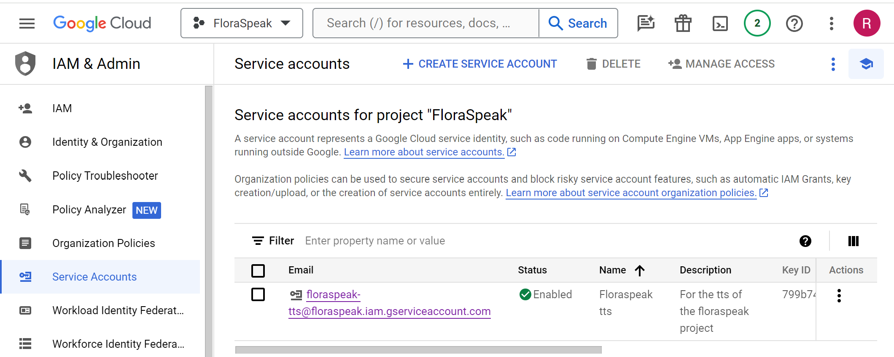
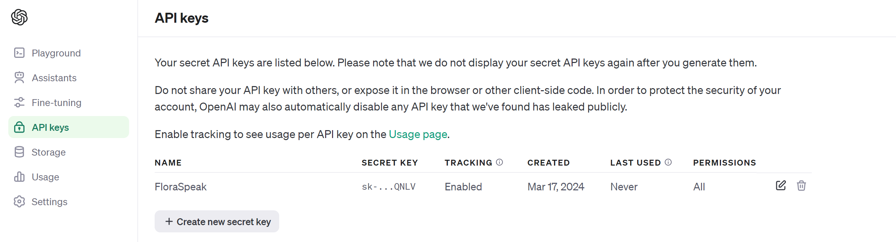
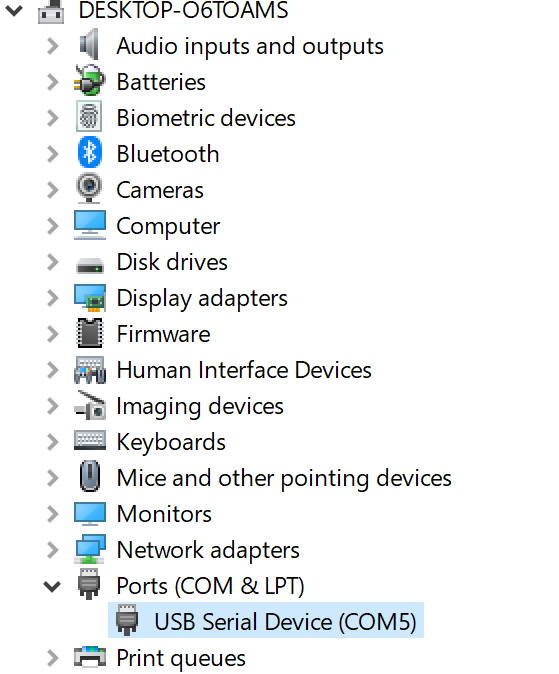

## SETUP:
1) This was written in Python 3.9.2. Install page here: https://www.python.org/downloads/release/python-392/ (If you are having issues with installing tiktocken not using the correct python version is likely the problem)

2) Intall rustup. See here: https://rustup.rs/ (Requires restart after install)

3) Activate the virtual enviroment
- On Windows run `.\generate-eviroment.bat` then `.\.venv\Scripts\activate`.
    If get an error where running scripts is disabled on the system run `Set-ExecutionPolicy Unrestricted -Scope Process` then try again.
- On Mac run `sh generate-enviroment.sh` then `source ./.venv/bin/activate`.

4) Run `pip install -r requirements.txt` to install all modules.

5) Create a .env file for the API keys we are about to set up. Use this as the inital contents:
AZURE_TTS_KEY=your_azure_tts_key_here
AZURE_TTS_REGION=your_azure_tts_region_here
GOOGLE_CLOUD_SERVICE_PATH=your_cloud_service_path
OPENAI_API_KEY=your_openai_api_key_here
PORT=your_port_here

6) Set up Azure speech to text
Pricing: https://azure.microsoft.com/en-us/free/
Setup:
- Go to Azure website and sign up/in: https://azure.microsoft.com/en-ca
- Search Speech Services on the top bar

- Create new service, here are the settings I used for basic. Everything else was default.

- Copy the API and set it as the value of AZURE_TTS_KEY in the .env file. Also copy the location and set it to the value of AZURE_TTS_REGION (Note it has to be the Location/Reigion located below the Key, visioble in the image. The location/reigion is sometimes listed elsewhere with the wrong formating for some stupid reason)

7) Set up Google Cloud text to speech
Pricing: https://cloud.google.com/text-to-speech/pricing
Setup:
- Go to the Google Could website and sign up/in: https://console.cloud.google.com/
- Enable text to speech API here: https://console.cloud.google.com/apis/library/texttospeech.googleapis.com

- Open the navigation menu beside the google cloud logo > IAM & Admin > Service Accounts > + CREATE SERVICE ACCOUNT
- Create service account, grant role of owner to make sure has permissions needed

- Click on the newly generated service account > keys tab > add key > create new key > JSON
- Download the .json file and put somewhere outside of the github repo
- Copy the filepath and set it as the value of GOOGLE_CLOUD_SERVICE_PATH in the .env file, make sure you include the .json file you download in the filepath. 

8) Set up openAI for ChatGPT
Pricing: https://openai.com/pricing
Setup:
- Go to openAI website and sign up/in: https://platform.openai.com/docs/overview
- Go to the side bar on the left and select usage if you wern't graced with free credits your going to have to buy credits, minimum of 5$, yay.
- Go to the side bar on the left again and select API Keys > Create new secret key

- Copy the generated API key and set it as the value of OPENAI_API_KEY in the .env file 

9) Set up Port
Note these instructions are for windows
- Open device manager
- Go to ports, note the Arduino must be plugged in for this show up

- Copy the com number and set it as the value of PORT in the .env file, here PORT='COM5'
- Note if something doesn't work baudrate and timeout might have to be updated to match what it is set for in the port for the arduino

## Using the App

1) Run `.\.venv\Scripts\activate`

2) Run `python python chatgpt_character.py'

3) Once it's running, press 4/button on Arduino depending on branch to start the conversation, and Azure Speech-to-text will listen to your microphone and transcribe it into text.

4) Once you're done talking, press 5/button on Arduino depending on branch. Then the code will send all of the recorded text to the Ai. Note that you should wait for the speech to be proccessed by Azure before pressing 5/button on Arduino depending on branch, check the terminal to see.

5) Wait a few seconds for OpenAi to generate a response and for Google Cloud to turn that response into audio. Once it's done playing the response, you can press 4/button on Arduino depending on branch to start the loop again and continue the conversation.
